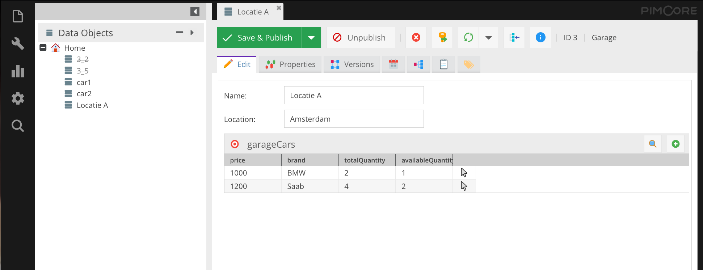

# Object bridge field

Allows editing an object inline that doesn't link directly many-to-many like
Example:
MainObject -> BridgeObject -> SourceObject allows to edit inline BridgeObject after linking a source object to it
Cart -> ProductItem -> Product

### How to install

1. Run ``composer require youwe/pimcore-object-bridge`` to receive the bundle
2. Enable the bundle ``bin/console  pimcore:bundle:enable ObjectBridgeBundle``
3. Then the field ``objectBridge`` should be available in field selector under relations (Add Data Component->Relation->objectBridge)

Allowed in:
* object: true,
* objectbrick: true,
* fieldcollection: true,
* localizedfield: true,
* classificationstore: false,
* block: true

Bridge object editing fields:
* numeric
* input
* select
* manyToOneRelation
* checkbox

*If not in list above then field will be read-only*

### Field specific settings

<dl>
  <dt>Source class</dt>
  <dd>Select which class should be used as primary class</dd>

  <dt>Source visible fields</dt>
  <dd>Which fields from source class should be displayed</dd>

  <dt>Bridge class</dt>
  <dd>Select which class should be created when selecting the source object</dd>

  <dt>Bridge visible fields</dt>
  <dd>Same as source fields but from bridge class</dd>

  <dt>Bridge field</dt>
  <dd>Which field should be used when linking source object to bridge object</dd>

  <dt>Bridge folder</dt>
  <dd>Where bridge objects should be stored after automatic creating</dd>
</dl>
Limitation:
When HREF is used, there can only be one class type linked. First one will be used.

### Example scenario

            +--------------+             +--------------+
            |              |             |              |
            |    Garage    |             |    Garage    |
            |              |             |              |
            +-+-----------++             +----+---------+
              |           |                   |
              |           |                   |
              |           |                   |
    +---------+---+    +--+----------+   +----+--------+
    |             |    |             |   |             |
    |  GarageCar  |    |  GarageCar  |   |  GarageCar  |
    |             |    |             |   |             |
    +---------+---+    +--+----------+   +----+--------+
              |           |                   |
              |           |     +-------------+
              |           |     |
    +---------+---+    +--+-----+----+
    |             |    |             |
    |     Car     |    |     Car     |
    |             |    |             |
    +-------------+    +-------------+

In this example, you would add the ObjectBridge field to Garage.
The bridge table would be GarageCar.
GarageCar would have a (single) HREF field to Car. 

Fields for example tables:

Garage
* name
* location
* garageCars (field type = object-bridge)

GarageCar
* totalQuantity
* availableQuantity
* car (field type = href)

Car
* type
* brand
* price

A certain car can be present in multiple garages, in different quantities.

See object bulk dump structure [here](Docs/json/structure_bridge.json)

### Screenshot

### Todo's:

* Option to add custom add new object window (now default add functionality)
* Default value
* Testing
